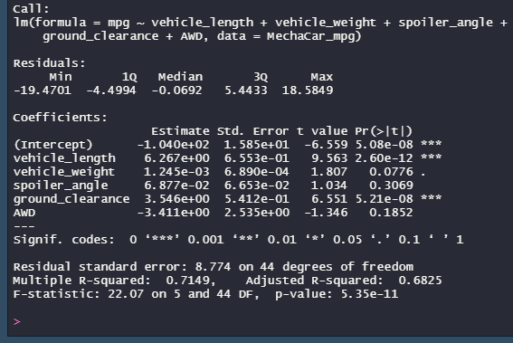
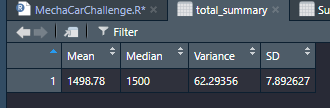
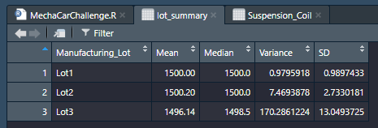
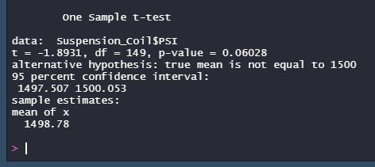
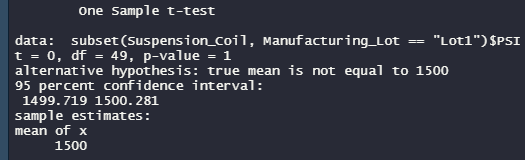
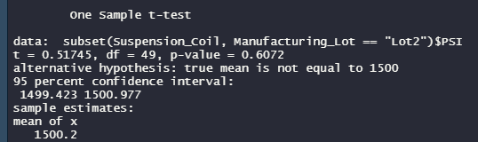
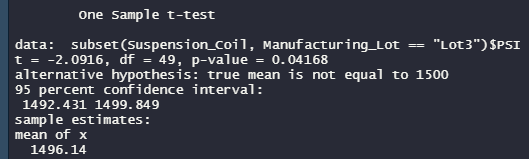

# MechaCar Statistical Analysis

## Linear Regression to Predict MPG

From the linear regression above the following questions can be answered:
1) Which variables/coefficients provided a non-random amount of variance to the mpg values in the dataset?
  
    According to the Pr(>|t|) values in the linear regression summary above, it can be concluded that intercept, vehicle length and   ground clearance provide a non-random amount of variance to the mpg values in the dataset. 
  
2) Is the slope of the linear model considered to be zero? Why or why not?

    Due to the significant variables in the test, the null hypothesis can be rejected. This means that the the slope of the model is not 0.
  
3) Does this linear model predict mpg of MechaCar prototypes effectively? Why or why not?
    
    This model does not provide an accurate prediction of the MPG. While the R-squared value shows a strong correlation, there are factors included in this model that do not have a strong infulence on the MPG. Also, because of the high significance of the intercept, it can be concluded there are other variable and factors that influence the MPG that have not been included in the model.
    
## Summary Statistics on Suspension
MechaCar dictates that the variace of the suspension coils cannot exceed 100 psi.

The above table does the summary statistics across all lots. According to these stats the variance of 62.29356 falls within the magic number of 100 psi.

Instead of showing the summary statistics for all of the lots together, this table shows them for each lot. According to this table, Lot 3's variance of 170.2861224 does not fall within the standard set forth of 100 psi. Lot 1 at 0.9795918 and Lot 2 at 7.4693878 both fall well within 1000 psi.

## T-Tests on Suspension Coils

The above data shows the t-test results comparing all manufacturing lots against a mean of 1500 PSI of the population. Due to the p-value of 0.06028 being larger than 0.05 signifance level. This shows that the differences in means is not statistically different and can be cause by chance rather than outside factors.

The following t-tests tested a subset, the 3 different Manufacturing Lots, against the population mean of 1500.

The t-test for Lot 1 produced a p-value of 1. This means that the there is not a significant difference between the two means and any differences are due to random chance.
    

The t-test for Lot 2 produced a p-value of 0.6072. This means that the there is not a significant difference between the two means and any differences are due to random chance.

The t-test for Lot 3 produced a p-value of 0.04068. This means that the difference between the two means is statistically different.

## Study Design : MechaCar vs Competition
The metrics that will be tested to compare the MechaCar against the competition will horse power. 

The null hypothesis will be that there is no statistical difference in horse power between the competition and MechaCar.
The alternative hypothesis will be that there is a statistical difference in horse power between the competition and MechaCar.

The statistical test that would be used is a two-sample t-test. This is because the test is between the distribution means of two different samples.

To run the test, there needs to be two seperate samples. One sample made up of horse power data for a grouping of MechaCars. A second sample made up of horse power data for a grouping of cars from the competition.
